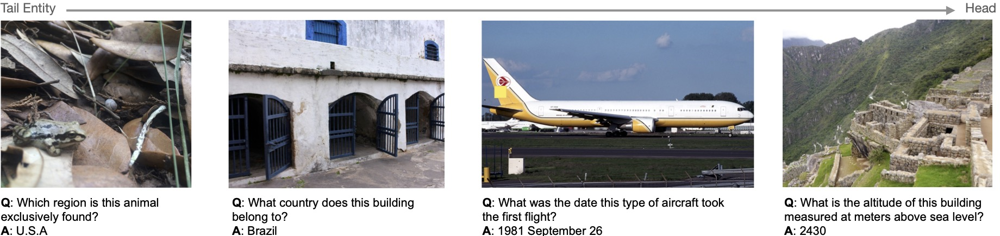

# Dataset Release Page for InfoSeek

**[Can Pre-trained Vision and Language Models Answer Visual Information-Seeking Questions?](https://arxiv.org/abs/2302.11713)**

[Yang Chen](https://edchengg.github.io/), [Hexiang Hu](https://www.hexianghu.com/), [Yi Luan](https://luanyi.github.io/), [Haitian Sun](https://scholar.google.com/citations?user=opSHsTQAAAAJ&hl=en), [Soravit Changpinyo](https://schangpi.github.io/), [Alan Ritter](http://aritter.github.io/index.html) and [Ming-Wei Chang](https://mingweichang.org/).

[[Project Page]](https://open-vision-language.github.io/infoseek/) [[Annotation]](#infoseek-annotation) [[Images]](#infoseek-images) [[Contributed Code]](https://github.com/edchengg/infoseek_eval) [[Leaderboard (Coming Soon)]]()

<p align="center">
     <br>
    InfoSeek, A New VQA Benchmark focus on Visual Info-Seeking Questions
</p>

Please use the following bib entry to cite this paper if you are using any resources from the repo.

```
@article{chen2023infoseek,
  title={Can Pre-trained Vision and Language Models Answer Visual Information-Seeking Questions?},
  author={Chen, Yang and Hu, Hexiang and Luan, Yi and Sun, Haitian and Changpinyo, Soravit and Ritter, Alan and Chang, Ming-Wei},
  journal={arXiv preprint arXiv:2302.11713},
  year={2023}
}
```


## Introduction

In this project, we introduce InfoSeek, a visual question answering dataset tailored for information-seeking questions that cannot be answered with only common sense knowledge. Using InfoSeek, we analyze various pre-trained visual question answering models and gain insights into their characteristics. Our findings reveal that state-of-the-art pre-trained multi-modal models (e.g., PaLI-X, BLIP2, etc.) face challenges in answering visual information-seeking questions, but fine-tuning on the InfoSeek dataset elicits models to use fine-grained knowledge that was learned during their pre-training.

## InfoSeek Annotation

The annotations are released as jsaonline file for each set and data split as discussed in the paper. 

Below is an example of the format for a training data:  

```
{
	"data_id": "infoseek_train_00000000",
	"image_id": "oven_01963180",
	"question": "Which place is this animal endemic to?",
	"answer": ["People's Republic of China"],
	"answer_eval": ["cn", "People's Republic of China", "China", "Mainland China", "China PR", "PR China", "CHN", "CN", "PRC", "\ud83c\udde8\ud83c\uddf3"], 
	"data_split": "train"
}
```

Here `image_id` is indicating which image files this annotation is associated with (note that InfoSeek images are derived from [OVEN](https://github.com/open-vision-language/oven/tree/main/image_downloads)). The `answer` field is indicate the most standard language term for the answer. And the `answer_eval` field is reserved for the evaluation purpose, which includes other accepatable equivalent forms of the `answer`, to imcrease the precision of evaluation.  


Following are links to each annotation file:

- Dataset Annotation
	- Train Split [Link (245M)](http://storage.googleapis.com/gresearch/open-vision-language/infoseek/infoseek_train.jsonl)
	- Val Split [Link (21M)](http://storage.googleapis.com/gresearch/open-vision-language/infoseek/infoseek_val.jsonl)
	- Test Split [Link (44M)](http://storage.googleapis.com/gresearch/open-vision-language/infoseek/infoseek_test.jsonl)
- KB mapping
	- Train Split [Link (84M)](http://storage.googleapis.com/gresearch/open-vision-language/infoseek/infoseek_train_withkb.jsonl)
	- Val Split [Link (21M)](http://storage.googleapis.com/gresearch/open-vision-language/infoseek/infoseek_val_withkb.jsonl)
- Human Set [Link (1.1M)](http://storage.googleapis.com/gresearch/open-vision-language/infoseek/infoseek_human.jsonl)


We also release the 6M wikipedia text information (derived from Wikidump 2022/10/01).

- 6 Million Wikipedia Text Information
	- [Full Info (6.9G)](http://storage.googleapis.com/gresearch/open-vision-language/Wiki6M_ver_1_0.jsonl.gz)
	- [Title Only (419M)](http://storage.googleapis.com/gresearch/open-vision-language/Wiki6M_ver_1_0_title_only.jsonl)

To use multimodal Wikipedia information, you would need to download images from the url in the field `wikipedia_image_url`.

## InfoSeek Images

See this [guideline](https://github.com/edchengg/oven_eval/tree/main/image_downloads) for image downloading
